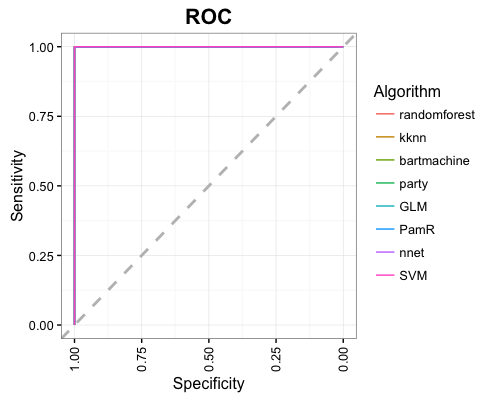
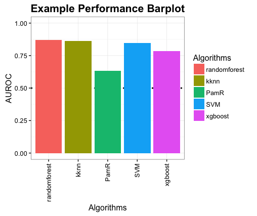
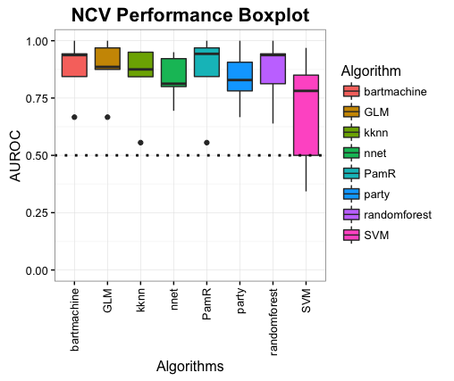
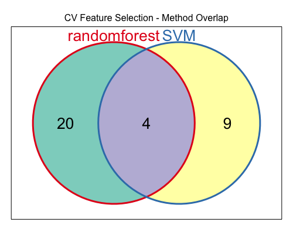
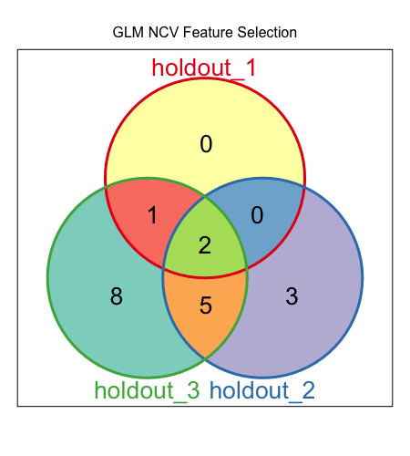
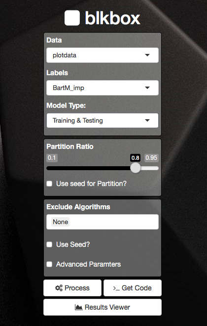
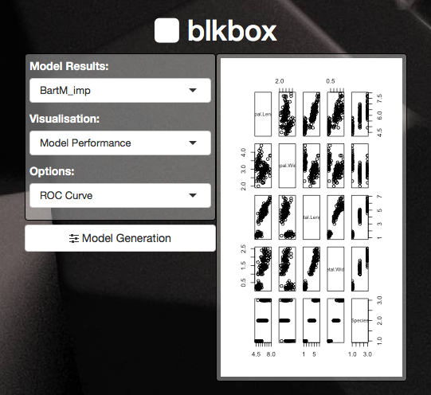

```{r setup, include=FALSE}
library(blkbox)
```
blkbox was designed to facilitate running multiple machine learning algorithms on a dataset with the following goals in mind:

* Simple and clear syntax
* Employ methods such as cross-fold validation and nested cross-fold validation
* Allow extraction of feature importance when possible
* Feature selection based on feature importance across models
* Provide clean publication ready figures of the results
* Run numerous algorithms from a single command

Once the user has decided upon a specific algorithm that is ideal for the task at hand a more direct approach using that algorithm alone can be developed.

The algorithms included within blkbox are: [randomForest](https://cran.r-project.org/web/packages/randomForest/), [bartMachine](https://cran.r-project.org/web/packages/bartMachine/), [party](https://cran.r-project.org/web/packages/party/), [nnet](https://cran.r-project.org/web/packages/nnet/), [PamR](https://cran.r-project.org/web/packages/pamr/), [knn](https://cran.r-project.org/web/packages/kknn/), [glmnet](https://cran.r-project.org/web/packages/glmnet/), [SVM](https://cran.r-project.org/web/packages/e1071/), [xgboost](https://cran.r-project.org/web/packages/xgboost/). The algorithms were chosen such that their scope covers a broad area, allowing one to discover which performs best on a particular task.


## Data Structure

blkbox requires the data be in a particular structure, the main data must be a `data.frame` with the rows corresponding to each sample within the dataset, and columns representing each feature.
The labels or outcomes of the samples are then supplied as a seperate vector (*character* or *numeric*), the order must match the corresponding row within the `data.frame` of data.

Additionally blkbox can only deal with binary classification tasks, therefore there must be two unique values present within the labels.

```{r}
# Example Data
my_data <- iris[1:100, 1:4]
head(my_data, 5)
# Example Labels
my_labels <- as.character(iris[1:100, 5])
unique(my_labels)

```

Having adhered to the data structure you can begin using blkbox to investigate your dataset.

## Using blkbox

There are three types of models that can be run within blkbox, each will be covered below.

### Training & Testing

This involves using a singular portion of the dataset to generate the model and testing or validating that models assumptions on a singular holdout portion of the dataset. Therefore this requires the user to partition the data into two sets, with each `data.frame` having a corresponding labels vector as described prior.

Data can be partitioned manually or using the `Partition` function, which can be supplied to `blkbox` using via the `data` parameter.

The last step before running the model is to decide on which models you will be running on the data, blkbox currently includes eight algorithms by default. Depending on the size of the dataset it may not be feasible to run all eight algorithms. The neural network algorithm package `nnet` and the bayesian regression trees package `bartMachine` can be quite slow or memory intensive if the dataset is large (features > 5,000) and therefore should be used after aggressive feature reduction (e.g. within `blkboxNCV`).

The function for generating a Training & Testing model is `blkbox`

```{r eval = FALSE, message = FALSE}
# Partitioning Data
my_partition = Partition(data = my_data,
                         labels = my_labels)

# Creating a Training & Testing Model
model_1 <- blkbox(data = my_partition)

````

### Cross-fold Validation

[Cross-fold Validation](https://en.wikipedia.org/wiki/Cross-validation_(statistics)) is often useful when the data being used has a limited number of samples or one wants to determine the robustness of a set of features for prediction. The process will seperate the data into *k* folds, where each fold is the same size (or as close to the same size as possible). Splitting of the data into folds is with respect to samples, where each fold will have the same features.

Models are then generated using *k* - 1 folds, leaving the remaining holdout fold to assess the model, this process is repeated *k* times until each fold has been used as a holdout. 

The performance of each model can be determined by the effectiveness in which they predicted the classification of the holdout, this can be left as seperate values over holdouts or averaged to assess the overall robustness.

Cross-fold Validation requires no partitioning beforehand and *k* = 10 by default.

```{r message = FALSE, eval = FALSE}
# Creating a Cross-fold Validation Model
model_2 <- blkboxCV(data = my_data, 
                    labels = my_labels)
````

### Nested Cross-fold Validation

Nested Cross-fold Validation is an extension upon Cross-fold Validation which can be useful to avoid overfitting when sample space may be particularly low. The process begins the same way as Cross-fold Validation, *k* fold are created and each will rotate as the holdout. 

However Nested will then take the *k* - 1 folds and execute a complete round of Cross-fold Validation, the contribution of each feature to the model on average is determined. Features are then selected based upon an AUC cutoff, this is defined cumulatively, therfore sum the importance of the top ranking features until that value reaches the total importance of all features multiplied by the AUC cutoff. 

This will allow the most important features to be retained whilst removing those will little contribution. `blkboxNCV` must therefore specify a `Method` and `AUC` parameter to determine which algorithm will be used to determine the importance of features internally and which cutoff is to be used. More depth on this will be covered in the worked examples.

Once the features are selected a model is generated from the data before Cross-fold Validation was run but only using those features deemed important and then testing it on the original holdout (reduced to the same features as the model).

This process is then repeated for each holdout, the main difference between Nested and standard Cross-fold Validation is that the features used in each holdout can vary and therefore each holdout cannot be expected to contain the same features. This can be useful for detecting reoccurent features and their robustness, moreso than with Cross-fold Validation.


```{r message = FALSE, eval = FALSE}
# Creating a Nested Cross-fold Validation Model
model_3 <- blkboxNCV(data = my_data,
                     labels = my_labels,
                     Method = "randomforest",
                     AUC = 0.9)
````

Because feature importance must be determined within the process the `Performance` function is intergrated automatically within `blkboxNCV` and defaults to all available metrics.

## Data Visualisation

blkbox provides functions that enable visualisation of results, regarding performance measures or finding commonalities and differences amongst algorithms models.

### ROC Curves

Receiver operating characteristic (ROC) curves are a measure of true positive and false positive rates, the area under this curve is often used as a metric for evaluating model performance. blkbox offers the `blkboxROC` function that uses the `pROC` package to calculate the curve and then feeds that to `ggplot2` for an aesthetic overhaul.

`blkboxROC` currently works on two of the three model types (`blkbox`, `blkboxCV`), `blkboxNCV` ROC curves will be added at a later version.

For Training and Testing as well as Cross-fold Validation the ROC curve is generated after calculating `Performance`.

```{r, eval = FALSE}
# Calculate Performance
perf = Performance(model_1)
# Standard ROC curve
blkboxROC(perf)

````


If repeatitions were run with `blkboxCV` for the models then the plot becomes faceted by repeat number. Similiarly when running `blkboxNCV` the plot can be generated for holdouts individually or combined, the former is faceted whilst the later is a singular ROC curve.

```{r eval=FALSE}
# Standard ROC curve for Cross-fold Validation with 2 repeats
model_2r <- blkboxCV(data = my_data, 
                    labels = my_labels,
                    repeats = 2)
perf_2r = Performance(model_2r)
blkboxROC(perf_2r)

# Alternvatively to avoid Faceting 
# perf_2r = Performance(model_2r, consensus = F)
# blkboxROC(perf_2r)

````


### Performance Measures

blkbox currently supports five different performance metrics; error rate, area under the receiver operating characteristic curve, Matthews correlation coefficient and F-score.

Metrics can be applied using the `Performance` function which will allow one more of the metrics to be specified. 

`cv.plot` has the Performance function embedded within it and therefore will not require calling `Performance` manually.

```{r eval=FALSE}
 
cv.plot(model_2, metric = "AUROC", title = "Example Performance Barplot")

````


`ncv.plot` is similar to `cv.plot` but does not recalculate the performance and uses only the exisiting metrics within a `blkboxNCV` model.
```{r eval=FALSE}
 
ncv.plot(model_3, metric = "AUROC", title = "NCV Performance Boxplot")

````



### Venn Diagrams

When comparing multiple algorithms it can be insightful to visualise the overlap between them, therefore `cv.venn` and `ncv.venn` allow comparison of what features were found to be important in each algorithm.


`cv.venn` can be used if more than one `Method` and a singular `AUC` were specified when generating a `blkboxCV` model. `cv.venn` will compare and intersect the features that survived the `AUC` cutoff in the specific algorithms (`Methods`).

```{r eval=FALSE}
# same model as before, now with feature selection after cross-fold validation
model_2x <- blkboxCV(data = my_data, 
                    labels = my_labels,
                    Method = c("randomforest", "SVM"),
                    AUC = 0.5)

cv.venn(model_2x)

````


**note:** *the image above is not generated from the iris dataset this code example uses as the number of features is too low*

`ncv.venn` varies from `cv.venn` in a major way, it doesnt directly compare algorithms but compares the features used in each holdout of `blkboxNCV`. This can be a measure of feature stability and be informative to adjustments made on the `AUC` and other parameters. 

```{r eval=FALSE}
# simply wrap the output of blkboxNCV in the ncv.venn function
ncv.venn(model_3)

````


**note:** *the image above is not generated from the iris dataset*


## Shiny Interface

blkbox provides a shiny interface that will enable a "code-free" approach. To begin using the shiny interface run `blkboxUI`.

The interface will allow the submission of a model directly to the current R session, however it will also have the capacity to provide the code used to generate the model. By providing the code as a text output one can easily paste this into any exisitng scripts (e.g. running blkbox on a high performance computing cluster as a submitted job).



`blkboxUI` will also allow the user to switch between two views, model generation and results visualisation.



## Solutions for Common Problems

### rJava & bartMachine
blkbox utilises `rJava` for the models created with `bartMachine`, therefore the memory allowed for use by java proccess must be set with `options(java.parameters = 'Xmx4g')` with the desired memory.
blkbox will raise the memory to four gigabytes by default, however this is not "locked in" until `bartMachine` is called for modelling and therefore can be adjusted after calling `library(blkbox)`.

```{r eval=FALSE}
library(blkbox)
# Allowed for 16 gigabytes of memory for rJava processes
options(java.parameters = 'Xmx16g')

```

However, if rJava has been used prior to loading `blkbox` it may be easiest to reset the R session and reload packages.

## Benchmarks & Memory Usage

blkbox incorperates a range of algorithms, however their demands for memory and run duration can be vastly different, which can become a major consideration when dealing with larger data.

As a rough qualitative guide the algorithms which consume the highest memory and time are `nnet`, `bartMachine`, and `party`.

Will soon update this vignette with **actual** benchmarks.

